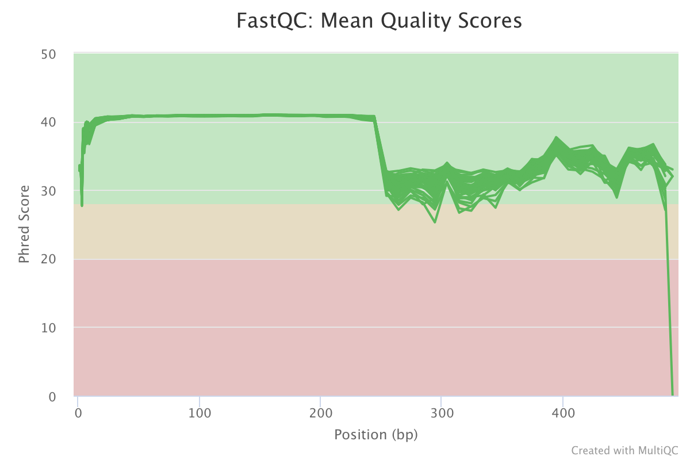
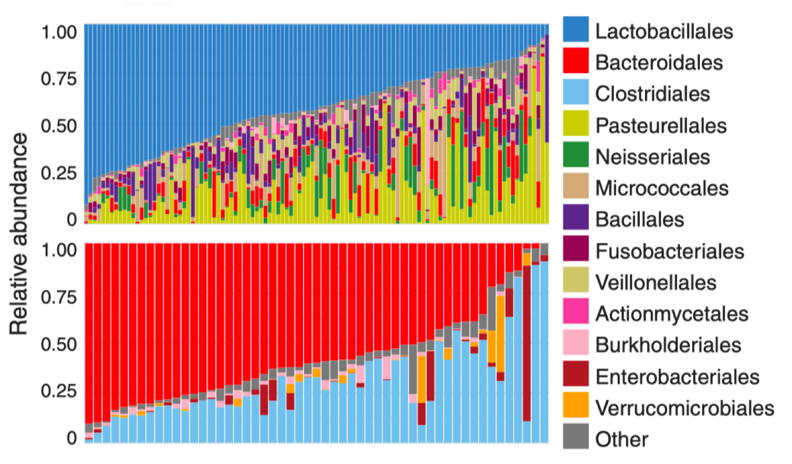
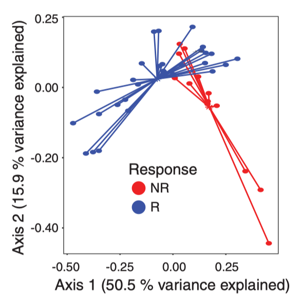
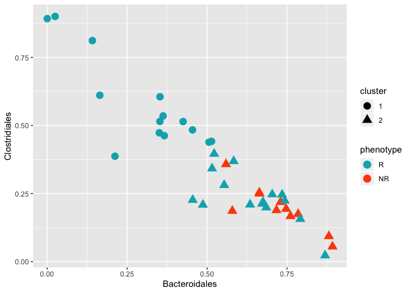
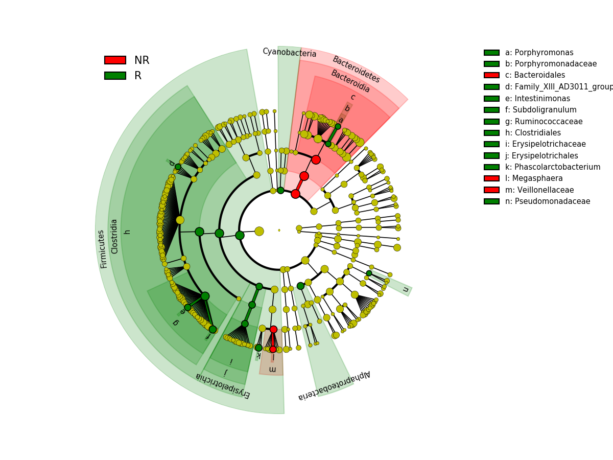
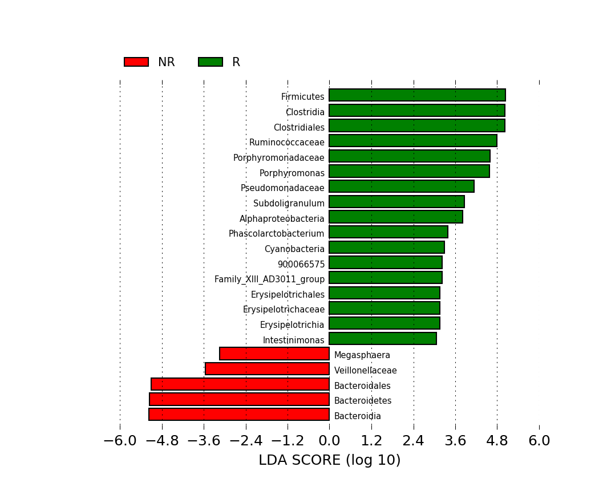
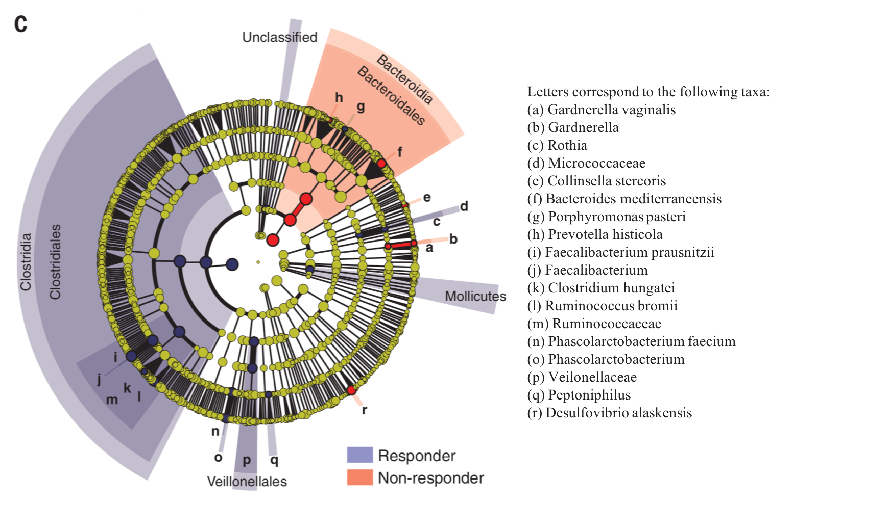
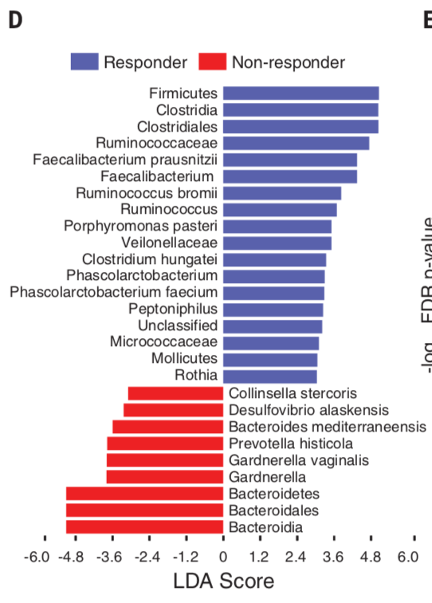
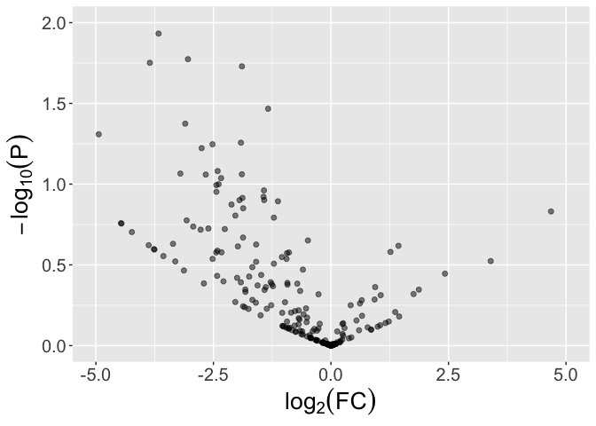

Re-analysis of Gopalakrishnan et al. Science 2018
================
yeguanhua

Note: This is a re-analysis workflow of Gopalakrishnan et al. Science
2018. Standardize data format and outputs with our in-house pipeline to
facilitate cross-study comparison.

``` r
# Preparations:
rm(list = ls())
library(pacman)
p_load(tidyverse, XML, readxl, ggplot2, ggpubr, vegan, VennDiagram, dada2)
p_load(RColorBrewer)
qual_col_pals = brewer.pal.info[brewer.pal.info$category == 'qual',]
# 74 distinctive colors in R:
distinctive_colors = unlist(mapply(brewer.pal, qual_col_pals$maxcolors, rownames(qual_col_pals))) %>% 
  .[-c(2)]
```

## Metadata

``` r
# Map metadata and sample_id
filenames <- dir()
sample_all <- tibble()
for (i in filenames) {
  meta <- xmlParse(file = i) %>% xmlRoot()
  meta_id <- xmlToList(meta[[1]][[4]]) %>% t() %>% as.tibble() 
  meta_data <- meta[[1]][[5]] %>% xmlToDataFrame() %>% t() %>% as.tibble()
  colnames(meta_data) <- meta_data[1,]
  meta_data <- meta_data[-1,]
  meta_extract <- bind_cols(meta_id, meta_data)
  sample_all <- bind_rows(sample_all, meta_extract)
}
colnames(sample_all)[1] <- "description"
sample_all
# Write to disk
write.csv(sample_all, file = "metadata/metadata_wargo.csv", 
          quote = F, row.names = F, na = "", append = F)
```

## Quality control

First, extract the sample\_id from matadata and save as
‘fecal\_16S\_sample\_id.txt’ in the same directory with the fastq
file. Then, creat a shell script ‘demux.sh’ that has following command
(by Jiangwei) :

``` bash
#!/usr/bin/bash
run_path=/home/yeguanhua/Wargo/PRJEB22894/ERR2162225
cd $run_path
for sam in `less fecal_16S_sample_id.txt`
do
    echo $sam
    less /home/yeguanhua/Wargo/PRJEB22894/ERR2162225/fecal_16S.fastq | grep $sam -A 3 > $sam.fastq
done
```

After running ‘this shell script’demux.sh’, the fastq file will be
splited into 43 fastq files by sample\_id. Move all fastq files that
generated to a new directory call ‘demux’. Creat a shell script ‘qc.sh’
that has following command (docker commands provided by Qinbingcai) :

``` bash
#!/usr/bin/bash
run_path=/home/yeguanhua/Wargo/PRJEB22894/ERR2162225/demux/
cd $run_path
for file in $(ls $run_path)
do
docker run -u $UID:$UID --rm -v $PWD:/data/ quay.io/biocontainers/fastqc:0.11.7--4 sh -c "mkdir -p /data/fastqc && fastqc --threads 4 --outdir /data/fastqc --noextract /data/$file"
done
docker run -u $UID:$UID --rm -v $PWD:/data/ quay.io/biocontainers/multiqc:1.6--py27h24bf2e0_0 sh -c "multiqc   -o /data/multiqc /data/fastqc"
```

After running ‘qc.sh’, there will be two new folders called ‘fastqc’ and
‘multiqc’. Within ‘multiqc’, the html file contain qc result for all
samples. Note: move ‘fasqc’ and ‘multiqc’ folder to elsewhere incase
causing error in dada2 processing.

MultiQC report:

<!-- -->

## Denoised with DADA2 (single end)

Note: remove ‘filtered’ folder before re-run.

``` r
# cd /home/yeguanhua/Wargo/PRJEB22894/ERR2162225/demux
# if [ -e filtered ]; then rm -rf filtered; fi
path <- "rawdata/PRJEB22894/ERR2162225/demux"
files <- list.files(path)
if ("filtered" %in% files) {
  system("rm -rf rawdata/PRJEB22894/ERR2162225/demux/filtered")
}
```

#### Filterring:

``` r
# The directory should contain demultiplexed fastq.gz files
path <- "rawdata/PRJEB22894/ERR2162225/demux"
# Filtered files go into the filtered file
filtpath <- file.path(path, "filtered")
fns <- list.files(path, pattern="fastq.gz")
out <- filterAndTrim(file.path(path,fns), file.path(filtpath,fns), truncLen=240, maxEE=2, 
                     truncQ=2, rm.phix=TRUE, compress=TRUE, verbose=TRUE, multithread=TRUE)
```

#### Sample inference:

``` r
# File parsing
filts <- list.files(filtpath, pattern="fastq.gz", full.names=TRUE)
sample.names <- dir("rawdata/PRJEB22894/ERR2162225/demux/filtered/") %>% 
  str_replace("\\.fastq\\.gz", "")
names(filts) <- sample.names
# Learn error rates
set.seed(100)
err <- learnErrors(filts, nbases = 1e8, multithread=TRUE, randomize=TRUE)
# Infer sequence variants(won't dereplicate)
dds <- vector("list", length(sample.names))
names(dds) <- sample.names
for(sam in sample.names) {
  cat("Processing:", sam, "\n")
  derep <- derepFastq(filts[[sam]])
  dds[[sam]] <- dada(derep, err=err, multithread=TRUE)
}
```

#### Construct sequence table and remove chimeras:

``` r
# Construct sequence
seqtab <- makeSequenceTable(dds)
# Check the demension of sequence table
dim(seqtab)
```

    ## [1]   40 9267

``` r
# Remove chimeras
seqtab_nochim <- removeBimeraDenovo(seqtab, method="consensus", multithread=TRUE)
# Check the demension
dim(seqtab_nochim)
```

    ## [1]   40 3136

``` r
# Inspect sequence remove rate
sum(seqtab_nochim)/sum(seqtab)
```

    ## [1] 0.8341207

#### Assign taxonomy:

``` r
tax_silva <- assignTaxonomy(seqtab_nochim, 
                            "dada2_database/silva_nr_v132_train_set.fa.gz", 
                            multithread=TRUE)
tax_gg <- assignTaxonomy(seqtab_nochim, 
                         "dada2_database/gg_13_8_train_set_97.fa.gz", 
                         multithread=TRUE)
```

#### Track reads through pipeline:

``` r
getN <- function(x) sum(getUniques(x))
track <- cbind(out, sapply(dds, getN), rowSums(seqtab_nochim))
colnames(track) <- c("input", "filtered", "dereplicated", "nonchim")
rownames(track) <- sample.names
track <- rownames_to_column(as.data.frame(track), var = "subject_id")
track$subject_id <- factor(track$subject_id, levels = track$subject_id)
track <- gather(track, 2:ncol(track), key = "stages", value = "reads")
track$stages <- factor(track$stages, levels = c("input", "filtered", "dereplicated", "nonchim"))
ggplot(track, aes(x = stages, y = reads, color = subject_id)) + 
    scale_color_manual(values = distinctive_colors) + 
    geom_point() + 
    geom_line(aes(group = subject_id))
```

<!-- -->

## Rarefaction plot

``` r
rarecurve(seqtab_nochim, step = 50, col = distinctive_colors)
```

<!-- -->

## Taxonomy comparison with original results

``` r
# Load original taxonomy classification
tax_origin <- read_excel(path = "original_files/original_taxonomic_classification_top50.xlsx", 
                         sheet = 2)
# Extract top 50 genus of Silva database
seqtab_t <- seqtab_nochim %>% t() %>% rowSums() %>% as.data.frame()
seqtab_top50 <- seqtab_t[1:50,] %>% as.data.frame()
rownames(seqtab_top50) <- rownames(seqtab_t)[1:50]
colnames(seqtab_top50) <- "Abundance"
for (i in rownames(seqtab_top50)) {
  seqtab_top50[rownames(seqtab_top50) == i, 'silva_Genus'] <- tax_silva[rownames(tax_silva) == i, 
                                                                        'Genus']
  }
# Comparison of Genus of Silva database
silva_Genus_venn <- venn.diagram(list("Original" = tax_origin$silva_Genus_origin, 
                                      "Re-analysis" = na.omit(unique(seqtab_top50$silva_Genus))), 
                                 filename = NULL, 
                                 fill = c("#00AFBB", "#FC4E07"), 
                                 cat.cex = 1, 
                                 cex = 2.5, 
                                 main = "Comparison of Genus overlap", 
                                 sub = "Silva database")
```

Comparison of Genus overlap (Silva database):

<!-- -->

## Creat function for converting dada2 results to OTU table

``` r
# Convert DADA2 results to OTU table
construct_otu_table <- function(seq, tax, level = "all", lefse = FALSE) {
  
  # Set options
  options(stringsAsFactors = FALSE)
  
  seq_tab <- t(seq) %>% as.data.frame()
  tax_tab <- as.data.frame(tax)
  for (i in rownames(tax_tab)) {
    if (tax_tab[rownames(tax_tab) == i, ] %>% is.na() %>% all()) {
      tax_tab <- subset(tax_tab, rownames(tax_tab) != i)
      seq_tab <- subset(seq_tab, rownames(seq_tab) != i)
    }
  }
  if (level == "all") {
    for (i in rownames(tax_tab)) {
      tax_tab[rownames(tax_tab) == i, 'Taxonomy'] <- tax[rownames(tax) == i,] %>% 
        na.omit() %>% str_c(collapse = "|")
    }
    tax_tab <- subset(tax_tab, select = Taxonomy)
  } else {
    tax_tab <- tax_tab %>% as.data.frame() %>% select(level)
    for (i in rownames(tax_tab)) {
      if (tax_tab[rownames(tax_tab) == i, ] %>% is.na()) {
        tax_tab <- subset(tax_tab, rownames(tax_tab) != i)
        seq_tab <- subset(seq_tab, rownames(seq_tab) != i)
      }
    }
    if (lefse) {
      tax <- tax %>% as.data.frame() %>% select(1:which(colnames(tax) == level))
      for (i in rownames(tax_tab)) {
        tax_tab[rownames(tax_tab) == i, level] <- tax[rownames(tax) == i,] %>% 
          na.omit() %>% str_c(collapse = "|")
      }
    }
  }
  otu_tab <- left_join(rownames_to_column(seq_tab), rownames_to_column(tax_tab), 
                       by = "rowname") %>% .[,-1]
  otu_tab <- t(otu_tab)
  colnames(otu_tab) <- otu_tab[nrow(otu_tab),]
  otu_tab <- otu_tab[-(nrow(otu_tab)),]
  otu_tab0 <- apply(otu_tab, 2, as.numeric)
  rownames(otu_tab0) <- rownames(otu_tab)
  otu_tab <- rowsum(t(otu_tab0), group = colnames(otu_tab0)) %>% 
    as.data.frame()
  return(otu_tab)
}
```

## Extract metadata

``` r
# Read metadata
metadata_wargo <- read_excel(path = "metadata/wargo_metadata.xlsx", sheet = 1)
# Remove Wargo.116774 (has the least reads counts)
# Remove Wargo.121585 (metadata is mixed with Wargo.133270)
metadata_wargo <- metadata_wargo[-c(3, 10),]
metadata_wargo <- metadata_wargo[metadata_wargo$subject_id %in% rownames(seqtab_nochim),] %>% 
  arrange(subject_id)
rownames(metadata_wargo) <- metadata_wargo$subject_id
# Change phenotype factor levels
metadata_wargo$phenotype <- factor(metadata_wargo$phenotype, levels = c("R", "NR"))
# Extract phenotype
phenotype_wargo <- select(metadata_wargo, phenotype) %>% as.data.frame()
```

## OTU distribution per sample in Genus level

``` r
# Construct otu table
otu_silva_genus <- construct_otu_table(seq = seqtab_nochim, tax = tax_silva, level = "Genus")
# Construct otu for ditribution plot
otu_distribution_genus <- otu_silva_genus %>% t() %>% as.data.frame() %>% rownames_to_column()
colnames(otu_distribution_genus)[1] <- "subject_id"
# Turn OTU to ggplot_type
otu_distribution_genus <- gather(otu_distribution_genus, 
                                 2:ncol(otu_distribution_genus), 
                                 key = "Genus", 
                                 value = "genus_abundance")
# Convert abundance to log10 and remove infinite value
otu_distribution_genus <- mutate(otu_distribution_genus, 
                                 `log10(genus_abundance)` = log10(genus_abundance)) %>% 
    filter(!is.infinite(.$`log10(genus_abundance)`))
# Find median for every samples
median_value <- otu_distribution_genus %>% 
  group_by(subject_id) %>% 
  dplyr::summarise(median_value = median(`log10(genus_abundance)`)) %>% 
  dplyr::arrange(median_value) %>% 
  left_join(as.data.frame(rownames_to_column(phenotype_wargo)), by = c("subject_id" = "rowname"))
# Add levels to subject_id according to median
otu_distribution_genus$subject_id <- factor(otu_distribution_genus$subject_id, 
                                            levels = median_value$subject_id)
# Box plot (black colors are R, red colors are NR)
ggboxplot(otu_distribution_genus, 
          x = "subject_id", 
          y = "log10(genus_abundance)", 
          add = "jitter", 
          add.params = list(size = 0.5), 
          outlier.shape = NA, 
          fill = "subject_id", 
          palette = distinctive_colors) + 
  # The order of phenotype must map the order of subject_id !!! So X-axis color can be correct.
  theme(axis.text.x = element_text(angle = 90, size = 8, color = median_value$phenotype))
```

<!-- -->

## Construct phylogenetic tree

``` r
# Construct phylogenetic tree step from Bioconductor workflow v2
seqs <- getSequences(seqtab_nochim)
names(seqs) <- seqs
# Performing a multiple-alignment using the DECIPHER R package
#BiocManager::install(pkgs=c("DECIPHER"))
p_load(DECIPHER)
alignment <- AlignSeqs(DNAStringSet(seqs), anchor=NA)
# The phangorn R package is then used to construct a phylogenetic tree
#BiocManager::install(pkgs=c("phangorn"))
p_load(phangorn)
phang.align <- phyDat(as(alignment, "matrix"), type="DNA")
dm <- dist.ml(phang.align)
treeNJ <- NJ(dm)  #Note: tip order != sequence order 
fit = pml(treeNJ, data=phang.align)
fitGTR <- update(fit, k=4, inv=0.2)
# Maximum likelihood tree with potim.pml
start_time_optim.pml <- Sys.time()
fitGTR <- optim.pml(fitGTR, model="GTR", optInv=TRUE, optGamma=TRUE, 
                    rearrangement = "stochastic", control = pml.control(trace = 0))
end_time_optim.pml <- Sys.time()
```

``` r
# optim.pml run time
end_time_optim.pml - start_time_optim.pml
```

    ## Time difference of 3.613857 hours

## Combine data into a phyloseq object

``` r
p_load(phyloseq)
ps_seqtab <- seqtab_nochim[metadata_wargo$subject_id,]
# Import data into phyloseq
ps <- phyloseq(tax_table(tax_silva), 
               sample_data(metadata_wargo), 
               otu_table(ps_seqtab, taxa_are_rows = F), 
               phy_tree(fitGTR$tree))
```

## Stacked bar plot of phylogenetic composition

``` r
# Construct percentage Order level otu
seqtab_percent <- t(apply(otu_table(ps), 1, function(x) x / sum(x)))
otu_silva_order_percent <- construct_otu_table(seq = seqtab_percent, 
                                               tax = tax_silva, 
                                               level = "Order")
# Construct data frame for stacked bar plot
stacked_bar_plot <- otu_silva_order_percent %>% t() %>% as.data.frame() %>% 
  .[,order(colSums(.), decreasing = TRUE)] %>% 
  .[order(.[,1], decreasing = TRUE),] %>% 
  rownames_to_column()
colnames(stacked_bar_plot)[1] <- "subject_id"
# Join phenotype
stacked_bar_plot <- left_join(stacked_bar_plot, 
                              as.data.frame(rownames_to_column(phenotype_wargo)), 
                              by = c("subject_id" = "rowname"))
# Add levels to subject_id
stacked_bar_plot$subject_id <- factor(stacked_bar_plot$subject_id, 
                                      levels = stacked_bar_plot$subject_id)
stacked_bar_plot <- gather(stacked_bar_plot, 
                           colnames(stacked_bar_plot)[2:(ncol(stacked_bar_plot)-1)], 
                           key = "Order", 
                           value = "abundance")
# Bar plot (black colors are R, red colors are NR)
ggplot(stacked_bar_plot, aes(x = subject_id, y = abundance)) + 
  theme(axis.text.x = element_text(angle = 90, size = 8, color = stacked_bar_plot$phenotype)) + 
  scale_fill_manual(values = distinctive_colors) + 
  geom_bar(mapping = aes(fill = Order), position = "fill", stat = "identity")
```

<!-- -->

Original stacked bar plot from Gopalakrishnan et al. Science 2018, oral
(n = 109, top) and fecal (n = 53, bottom), Order level:

<!-- -->

## Alpha diversity

### Inverse Simpson

Phyloseq::plot\_richness can draw alpha diversity plots, but the plots
are indistinguishable, so use ggpbur package to draw alpha diversity
plots (by JiangWei) :

``` r
# Change phenotype to numeric to calculate wilcox-test
phenotype_4_wilcox <- select(metadata_wargo, phenotype) %>% as.data.frame()
phenotype_4_wilcox <- plyr::revalue(phenotype_4_wilcox$phenotype, c(R = 1, NR = 0))
```

``` r
# Inverse Simpson diversity
InvSimpson_alpha <- plot_richness(ps, x = "phenotype", measures = "InvSimpson")
# Wilcox-test p-value (Mann-Whitney U test)
InvSimpson_w_p <- wilcox.test(InvSimpson_alpha$data$value ~ phenotype_4_wilcox)$p.value
# Box plot
ggboxplot(InvSimpson_alpha$data, 
          x = "phenotype", 
          y = "value", 
          add = "jitter", 
          add.params = list(size = 3), 
          color = "phenotype", 
          outlier.shape = NA, 
          palette = c("#00AFBB", "#FC4E07")) + 
  ylab("InvSimpson Diversity") + 
  annotate("text", x = 2, y = 1, 
           label = paste("wilcox p-value = ", round(InvSimpson_w_p, 4), sep = ""), 
           size = 3)
```

<!-- -->

Original alpha diversity from Gopalakrishnan et al. Science
2018:

<!-- -->

### ANOSIM

``` r
ANOSIM_otu <- left_join(rownames_to_column(as.data.frame(otu_table(ps))), 
                        rownames_to_column(phenotype_wargo))
ANOSIM <- anosim(vegdist(otu_table(ps)), ANOSIM_otu$phenotype)
plot(ANOSIM)
```

<!-- -->

## Beta diversity

### Weighted-Unifrac

``` r
# Weighted-Unifrac
# Note: use phyloseq::distance instead of distance
wu_pcoa <- cmdscale(phyloseq::distance(physeq = ps, method = "wunifrac"), k = 2, eig = T)
wu_mds1 <- as.data.frame(wu_pcoa$points)
colnames(wu_mds1) <- c("pc1", "pc2")
wu_data_ord <- merge(wu_mds1, metadata_wargo, by = "row.names")
ggplot(data = wu_data_ord, aes(x = pc1, y = pc2)) + 
  geom_point(aes(color = phenotype), size = 3) + 
  xlab(paste("PC1 ", round(100*as.numeric(wu_pcoa$eig[1]/sum(wu_pcoa$eig)), 2), "%", sep = " ")) + 
  ylab(paste("PC2 ", round(100*as.numeric(wu_pcoa$eig[2]/sum(wu_pcoa$eig)), 2), "%", sep = " ")) + 
  scale_color_manual(values=c("#00AFBB", "#FC4E07"))
```

<!-- -->

Original beta diversity from Gopalakrishnan et al. Science 2018:

<!-- -->

### NMDS (Non-metric Multidimensional scaling)

``` r
p_load(MASS)
p_load(plotly)
```

#### jaccard distance:

``` r
# NMDS with jaccard distance:
otu_dis_j <- vegdist(otu_table(ps), method = "jaccard")
otu_nmds_j <- metaMDS(otu_table(ps), distance = "jaccard")
```

``` r
# NMDS stress polt
stressplot(otu_nmds_j, otu_dis_j)
```

<!-- -->

``` r
# NMDS points plot with phenotype
otu_nmds_points_j <- merge(otu_nmds_j$points, phenotype_wargo, by = "row.names")
ggplot(otu_nmds_points_j, aes(MDS1, MDS2, col = phenotype)) + 
  geom_point() + 
  theme(axis.title = element_text(size = 14), 
        axis.text = element_text(size = 12), 
        legend.title = element_blank()) + 
  scale_color_manual(values=c("#00AFBB", "#FC4E07"))
```

<!-- -->

#### mountford distance:

``` r
# NMDS with mountford distance:
otu_dis_m <- vegdist(otu_table(ps), method = "mountford")
otu_nmds_m <- metaMDS(otu_table(ps), distance = "mountford")
```

``` r
# NMDS stress polt
stressplot(otu_nmds_m, otu_dis_m)
```

<!-- -->

``` r
# NMDS points plot with phenotype
otu_nmds_points_m <- merge(otu_nmds_m$points, phenotype_wargo, by = "row.names")
ggplot(otu_nmds_points_m, aes(MDS1, MDS2, col = phenotype)) + 
  geom_point() + 
  theme(axis.title = element_text(size = 14), 
        axis.text = element_text(size = 12), 
        legend.title = element_blank()) + 
  scale_color_manual(values=c("#00AFBB", "#FC4E07"))
```

<!-- -->

### DPCoA

``` r
pslog <- transform_sample_counts(ps, function(x) log(1 + x))
out.dpcoa.log <- ordinate(pslog, method = "DPCoA")
evals <- out.dpcoa.log$eig
# DPCoA for samples
plot_ordination(pslog, 
                out.dpcoa.log, 
                type = "samples", 
                color = "phenotype") + 
  coord_fixed(sqrt(evals[2] / evals[1])) + 
  scale_color_manual(values=c("#00AFBB", "#FC4E07"))
```

<!-- -->

``` r
# DPCoA for taxonomy: Order
plot_ordination(pslog, 
                out.dpcoa.log, 
                type = "species", 
                color = "Order") + 
  coord_fixed(sqrt(evals[2] / evals[1])) + 
  scale_color_manual(values = distinctive_colors)
```

<!-- -->

### K-means

``` r
# Construct percentage OTU table
otu_silva_order_percent <- construct_otu_table(seq = seqtab_percent, 
                                               tax = tax_silva, 
                                               level = "Order")
# Construct K-means input table
# Rows are subject_id, columns are Order
km_otu <- otu_silva_order_percent %>% t() %>% as.data.frame() %>% 
  .[,order(colSums(.), decreasing = TRUE)] %>% rownames_to_column()
colnames(km_otu)[1] <- "subject_id"
# Join phenotype
km_otu <- left_join(km_otu, rownames_to_column(as.data.frame(phenotype_wargo)), 
                    by = c("subject_id" = "rowname"))
# Calculate k-means
km <- kmeans(km_otu[,2:(ncol(km_otu)-1)], centers = 2)
# Plot k-means on the two most abundant taxonomy, labeled by R vs NR
km_plot <- km_otu[,-c(4:(ncol(km_otu)-1))] %>% cbind(as.factor(km$cluster))
colnames(km_plot)[ncol(km_plot)] <- "cluster"
ggplot(km_plot, aes(Bacteroidales, Clostridiales)) + 
  geom_point(mapping = aes(color = phenotype, shape = cluster), size = 4) + 
  scale_color_manual(values=c("#00AFBB", "#FC4E07"))
```

<!-- -->

## LEfSe result

``` r
# Convert OTU table to LEfSe input
lefse_input <- rbind(construct_otu_table(seqtab_nochim, tax_silva, "Kingdom", lefse = TRUE), 
                     construct_otu_table(seqtab_nochim, tax_silva, "Phylum", lefse = TRUE), 
                     construct_otu_table(seqtab_nochim, tax_silva, "Class", lefse = TRUE), 
                     construct_otu_table(seqtab_nochim, tax_silva, "Order", lefse = TRUE), 
                     construct_otu_table(seqtab_nochim, tax_silva, "Family", lefse = TRUE), 
                     construct_otu_table(seqtab_nochim, tax_silva, "Genus", lefse = TRUE)) %>% 
  as.data.frame()
# convert to abundance
lefse_input <- sweep(lefse_input, 2, colSums(lefse_input), '/') %>% rownames_to_column()
lefse_phenotype <- phenotype_wargo %>% rownames_to_column() %>% t() %>% as.data.frame() %>% 
  rownames_to_column()
lefse_phenotype[1,1] <- "subject_id"
colnames(lefse_phenotype) <- colnames(lefse_input)
lefse_phenotype <- lefse_phenotype[nrow(lefse_phenotype):1,]
lefse_input <- rbind(lefse_phenotype, lefse_input)
write_tsv(lefse_input, path = "LEfSe/lefse_inpiut.tsv", col_names = FALSE)
```

LEfSe results was generated by Galaxy web application
(<http://huttenhower.sph.harvard.edu/galaxy/>):

<!-- --><!-- -->

Original LEfSe results from Gopalakrishnan et al. Science 2018:

<!-- --><!-- -->

## Log2 Fold Change

``` r
p_load(DESeq2)
# Construt table for DESeq2
deseq2_dds <- DESeqDataSetFromMatrix(countData = otu_silva_genus, 
                                     colData = phenotype_wargo, 
                                     design = ~ phenotype)
deseq2_dds <- DESeq(deseq2_dds)
# Calculate log2 fold change
deseq2_res <- results(deseq2_dds, addMLE = FALSE)
deseq2_res <- deseq2_res[order(deseq2_res$pvalue),]
# Plot fold change
deseq2_plot <- deseq2_res %>% as.data.frame()
colnames(deseq2_plot) <- colnames(deseq2_res)
rownames(deseq2_plot) <- rownames(deseq2_res)
ggplot(data = deseq2_plot, aes(x = log2FoldChange, y = -log10(pvalue))) + 
  geom_point(alpha = 0.5, size = 1.75) + 
  theme(legend.position = "none") + 
  xlim(c(-5, 5)) + ylim(c(0, 2)) + 
  labs(x = expression(log[2](FC)), y = expression(-log[10](P))) + 
  theme(axis.title.x=element_text(size=20), axis.text.x=element_text(size=15)) + 
  theme(axis.title.y=element_text(size=20), axis.text.y=element_text(size=15))
```

<!-- -->

## Compare taxonomy overlap between Log2FC and LEfSe:

``` r
# Taxonomy in Log2FC which pvalue < 0.5, |log2FC| > 1
deseq2_res2 <- deseq2_plot[which(deseq2_plot$pvalue < 0.5 & abs(deseq2_plot$log2FoldChange) > 1),] %>% 
  rownames_to_column()
# LEfSe result was generated by LEfSe docker (by Jiangwei)
lefse_res <- readxl::read_excel(path = "LEfSe/lefse_res.xlsx", col_names = FALSE)
lefse_res <- lefse_res[which(!is.na(lefse_res[,3])),]
lefse_res <- str_replace(lefse_res[[1]], "^.+\\.", "")
foldchange_venn <- venn.diagram(list("Log2FC" = deseq2_res2$rowname, "LEfSe" = lefse_res), 
                                filename = NULL, 
                                fill = c("#00AFBB", "#FC4E07"), 
                                cat.cex = 1, 
                                cex = 2.5, 
                                main = "Taxonomy overlap between Log2FC and LEfSe")
grid::grid.draw(foldchange_venn)
```

<!-- -->

## PICRUSt

``` r
# Export DADA2 sequences to fasta file
seqs2fasta = function(seq_tab, out_path) {
  seqtab.t = as.data.frame(t(seq_tab))
  seqs = row.names(seqtab.t)
  row.names(seqtab.t) = paste0("OTU", 1:nrow(seqtab.t))
  seqs = as.list(seqs)
  seqinr::write.fasta(sequences = seqs, names = row.names(seqtab.t), file.out = out_path)
}
# must have a exist output path
seqs2fasta(seq_tab = seqtab_nochim, 
           out_path = "rawdata/PRJEB22894/ERR2162225/demux/filtered/seqs.fasta")
```

``` bash
# BLAST OTU (by Qinbingcai)
/home/yeguanhua/PICRUSt/makeblastdb -in /home/DataShare/Database/Microbiome/marker_ref/gg_13_8_otus/rep_set/99_otus.fasta -input_type fasta -dbtype nucl -max_file_sz 1GB -out subject
/home/yeguanhua/PICRUSt/blastn -db subject -query seqs.fasta -out otu_blast.tsv -outfmt 6 -num_threads 10 -evalue 1e-5 -max_target_seqs 1
```

``` r
# Construct OTU table for PICRUSt
otu_id <- read_tsv(file = "PICRUSt/otu_blast.tsv", col_names = F) %>% 
  select(X1, X2)
PICRUSt_otu <-  as.data.frame(t(seqtab_nochim))
row.names(PICRUSt_otu) <-  paste0("OTU", 1:nrow(PICRUSt_otu))
PICRUSt_otu <- rownames_to_column(PICRUSt_otu)
PICRUSt_otu <- left_join(otu_id, PICRUSt_otu, by = c("X1" = "rowname"))
PICRUSt_otu <- PICRUSt_otu[,-1] %>% t()
colnames(PICRUSt_otu) <- PICRUSt_otu[1,]
PICRUSt_otu <- PICRUSt_otu[-1,]
PICRUSt_otu <- rowsum(t(PICRUSt_otu), group = colnames(PICRUSt_otu)) %>% as.data.frame()
# Run PICRUSt in R
#install.packages("themetagenomics")
#BiocManager::install(pkgs=c("themetagenomics"))
p_load(themetagenomics)
ref <- "PICRUSt/themetagenomics_data"
PICRUSt_result <- picrust(PICRUSt_otu, rows_are_taxa=TRUE, 
                          reference='gg_ko', reference_path=ref, 
                          cn_normalize=TRUE, sample_normalize=FALSE, drop=TRUE)
PICRUSt_result$fxn_table[1:5,1:5]
names(PICRUSt_result$fxn_meta)
head(PICRUSt_result$fxn_meta$KEGG_Description)
```

## Save results

``` r
## Save results
#save(list = ls(), 
#     file = paste("Re-analysis_Wargo_", Sys.Date(), ".rdata", sep = ""))
```
